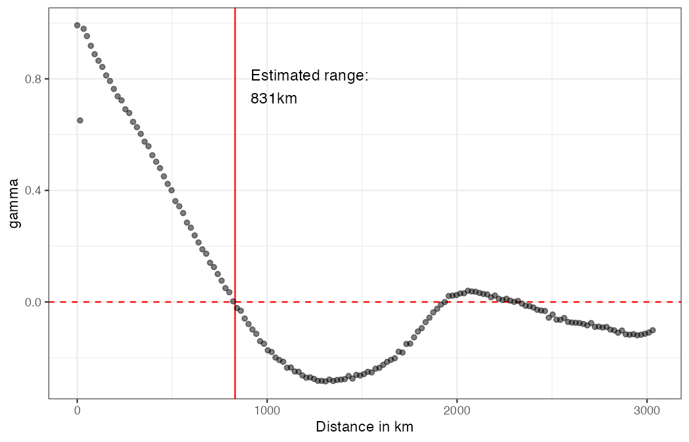

# SpatialInference

<!-- badges: start -->
[](https://github.com/axlehner/SpatialInference)
[](https://www.gnu.org/licenses/gpl-3.0)
<!-- badges: end -->

Fast computation of Conley (1999) spatial HAC standard errors for regression models with geo-coded data, using the C++ implementation by [Darin Christensen](https://github.com/darinchristensen/conley-se) (Christensen, Hartman, and Samii 2021). Includes a data-driven bandwidth selection method based on the covariogram range of regression residuals (Lehner 2026).

## Features

- **Conley spatial HAC standard errors** with six kernel functions (Bartlett, Epanechnikov, Gaussian, Parzen, Biweight, Uniform) and Haversine great-circle distances
- **Covariogram-based bandwidth selection** — estimates the spatial correlation range from the empirical covariogram, providing a principled cutoff distance
- **Inverse-U diagnostic plot** — visualises how the Conley SE varies with the bandwidth, revealing the inverse-U relationship documented in Lehner (2026)
- **Performance** — distance matrix computation, kernel weighting, and variance component accumulation are implemented in C++ via Rcpp/RcppArmadillo

## Installation

Install the development version from GitHub:

```r
# install.packages("devtools")
devtools::install_github("axlehner/SpatialInference")
```

### macOS note

A Fortran compiler is required for LAPACK/BLAS. If you encounter gfortran issues, see [this thread](https://github.com/RubD/Giotto_site/issues/11).

## Quick start

```r
library(SpatialInference)
library(lfe)
data("US_counties_centroids")

# 1. Estimate the correlation range from the covariogram
covgm_range(US_counties_centroids)
```



```r
# 2. Compute Conley standard errors at the estimated bandwidth
reg <- felm(noise1 ~ noise2 | unit + year | 0 | lat + lon,
            data = US_counties_centroids, keepCX = TRUE)

vcvs <- conley_SE(reg, unit = "unit", time = "year",
                  lat = "lat", lon = "lon",
                  kernel = "epanechnikov", dist_cutoff = 831)

# Spatial standard errors:
sqrt(diag(vcvs$Spatial))

# Convenience wrapper (returns a single SE):
compute_conley_lfe(reg, cutoff = 831, kernel_choice = "epanechnikov")
```

```r
# 3. Visualise the inverse-U relationship
inverseu_plot_conleyrange(US_counties_centroids,
                          cutoffrange = seq(1, 2501, by = 200))
```

## Key functions

| Function | Description |
|---|---|
| `conley_SE()` | Conley spatial HAC variance-covariance matrices (spatial, serial, and combined) |
| `compute_conley_lfe()` | Convenience wrapper returning a single Conley SE |
| `covgm_range()` | Estimate and plot the correlation range from a covariogram |
| `extract_corr_range()` | Extract the zero-crossing range from a covariogram or correlogram |
| `inverseu_plot_conleyrange()` | Diagnostic plot of SE vs. bandwidth (inverse-U) |
| `lm_sac()` | All-in-one: regression + Moran's I + Conley SEs |
| `DistMat()` | Kernel-weighted spatial distance matrix (C++) |

## References

Lehner, A. (2026). Bandwidth selection for spatial HAC standard errors. *arXiv preprint* arXiv:2603.03997. [doi:10.48550/arXiv.2603.03997](https://doi.org/10.48550/arXiv.2603.03997)

Conley, T. G. (1999). GMM estimation with cross sectional dependence. *Journal of Econometrics*, 92(1), 1--45. [doi:10.1016/S0304-4076(98)00084-0](https://doi.org/10.1016/S0304-4076(98)00084-0)

Christensen, D., Hartman, A. C. and Samii, C. (2021). Legibility and external investment: An institutional natural experiment in Liberia. *International Organization*, 75(4), 1087--1108. [doi:10.1017/S0020818321000187](https://doi.org/10.1017/S0020818321000187)
